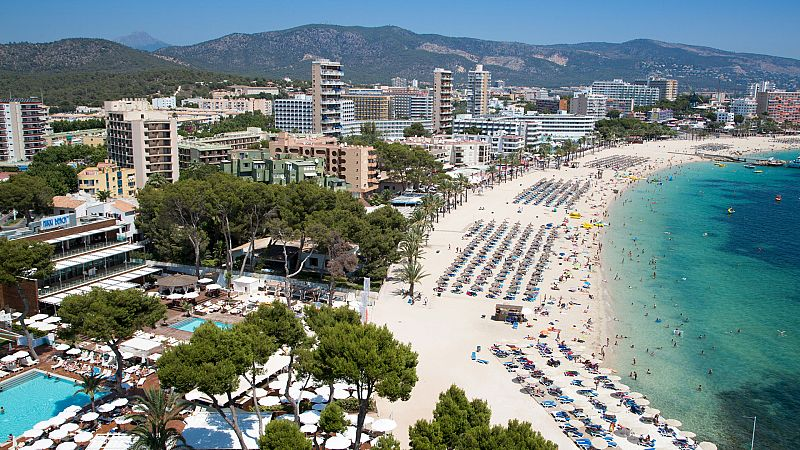

<p style="text-indent: 0;">Fecha última actualización : `r format(Sys.Date(), '%B %d, %Y')`.
</p>


```{r,echo=FALSE}
knitr::opts_chunk$set(
  warning = FALSE,
  message = FALSE,
  echo=FALSE
)
```

```{r, echo = FALSE,message = FALSE,warning = FALSE}
if (!require(wordcloud)) install.packages('wordcloud') 
library(wordcloud)
if (!require(RColorBrewer)) install.packages('RColorBrewer') 
library(RColorBrewer)
if (!require(GGally)) install.packages('GGally') 
library(GGally)
if (!require(openxlsx)) install.packages('openxlsx')
library(openxlsx)
if (!require(pxR)) install.packages('pxR') 
library(pxR)
if (!require(patchwork)) install.packages('patchwork') 
library(patchwork)
if (!require(ggplot2)) install.packages('ggplot2')
library(ggplot2)
if (!require(tidyverse)) install.packages('tidyverse') 
library(tidyverse)
if (!require(fpp3)) install.packages('fpp3')
library(fpp3)
if (!require(urca)) install.packages('urca')
library(urca)
if (!require(scales)) install.packages('scales')
library(scales)
if (!require(highcharter)) install.packages('highcharter') 
library(highcharter) 
if (!require(leaflet)) install.packages('leaflet')
library(leaflet) 
if (!require(geojsonio)) install.packages('geojsonio') 
library(geojsonio) 
if (!require(plotly)) install.packages('plotly') 
library(plotly)
if (!require(MASS)) install.packages('MASS')
library(MASS)
if (!require(dplyr)) install.packages('dplyr')
library(dplyr)
```

<p style="text-indent: 0;">Adriana Peñate Sosa | [Cuadro de mandos](http://10.22.143.222:3838/sample-apps/a2543/Dashboard-PP.Rmd)
</p>

<div style="text-align: center; margin-top: 20px;">
  
</div>


### Estado actual y objetivos del estudio sobre el turismo en España

En los últimos cinco años, el sector turístico en España ha experimentado importantes cambios, impulsados tanto por factores globales como por situaciones particulares dentro del país. Desde 2019 hasta la actualidad, el turismo ha sido una de las piedras angulares de la economía española, representando una fuente esencial de ingresos, empleos y una contribución significativa al Producto Interior Bruto (PIB). Sin embargo, la pandemia de COVID-19, las fluctuaciones económicas y el reciente interés por el turismo sostenible han transformado profundamente las dinámicas y patrones de visita en las distintas Comunidades Autónomas de España.

Este estudio se enfoca en analizar y comprender la evolución del turismo en las diversas regiones de España desde 2019, explorando tanto los cambios en el flujo de visitantes como el impacto económico de este sector. Con datos detallados de cada Comunidad Autónoma, el estudio aborda cómo el turismo ha contribuido al PIB nacional y las variaciones en su rendimiento a lo largo del tiempo, especialmente en un periodo marcado por grandes desafíos y cambios estructurales. Además, se examina cómo estos cambios pueden guiar estrategias sostenibles y adaptativas para el futuro del turismo en España.

El proyecto se alinea con varios Objetivos de Desarrollo Sostenible (ODS) promovidos por la Unión Europea, destacando su relevancia en el ámbito socioeconómico y ambiental. Respecto al ODS 8: Trabajo decente y crecimiento económico, analiza el impacto del turismo en el empleo y el crecimiento inclusivo, mientras que en el ODS 12: Producción y consumo responsables, promueve un modelo turístico sostenible que minimiza los impactos negativos sobre los recursos naturales y las comunidades locales. Además, contribuye al ODS 13: Acción por el clima, fomentando prácticas que reduzcan la huella de carbono asociada al turismo. Por último, bajo el ODS 17: Alianzas para lograr los objetivos, refuerza la colaboración entre instituciones académicas, sector privado y responsables políticos, ofreciendo datos clave para desarrollar políticas efectivas.

En términos técnicos y científicos, el proyecto aplica técnicas avanzadas de limpieza y análisis de datos, estableciendo un enfoque riguroso y reproducible que sirve como modelo para futuras investigaciones. La generación de indicadores clave como el gasto turístico y la duración media de las estancias permite identificar patrones y tendencias relevantes. Al abordar temas como el turismo sostenible y las nuevas preferencias de los viajeros, este análisis sienta las bases para estrategias políticas fundamentadas, fortaleciendo la competitividad y sostenibilidad del turismo en España.

### Objetivos específicos

<p style="text-indent: 0;">**Análisis de tendencias en turismo**: Desglosar los datos turísticos por Comunidad Autónoma, identificando variaciones en el número de visitantes, estancias y gasto turístico.</p>

<p style="text-indent: 0;">**Impacto económico**: Evaluar la contribución del sector turístico al PIB español, resaltando la importancia del turismo en la economía.</p>

<p style="text-indent: 0;">**Factores de influencia**: Investigar los factores que han influido en la evolución del turismo en los últimos cinco años, como la pandemia, los cambios en las preferencias de los viajeros y las políticas de sostenibilidad implementadas a nivel local y nacional.</p>

Con esta visión, el estudio proporcionará una visión integral del turismo en España en los últimos cinco años, ofreciendo una base sólida para la toma de decisiones estratégicas en el sector turístico nacional y regional.

#### Aportaciones del Turismo a la Economía Española

El turismo ha sido un pilar fundamental para la economía española en los últimos años, con una evolución marcada por los efectos de la pandemia de COVID-19 y la recuperación posterior. Desde 2019, este sector ha mostrado cambios significativos en el número de turistas, pernoctaciones, motivos de viaje y su impacto económico, consolidando su papel como uno de los motores principales del Producto Interior Bruto (PIB).

#### Evolución del Turismo en España (2019-2023)
En 2019, España recibió 83,5 millones de turistas internacionales, logrando un récord histórico. Este flujo generó ingresos cercanos a 92.000 millones de euros, con pernoctaciones en alojamientos turísticos que superaron los 469 millones, según el Instituto Nacional de Estadística (INE). Sin embargo, la llegada de la pandemia en 2020 causó una drástica reducción, con 19 millones de turistas internacionales y una caída del 77% en las pernoctaciones.

En 2021, comenzó una recuperación moderada, alcanzando 31,1 millones de visitantes internacionales y registrándose un incremento en el turismo interno. Esta tendencia se intensificó en 2022 con 71,6 millones de turistas, mientras que en 2023, España volvió a superar las cifras prepandemia con 85,1 millones de turistas internacionales y un gasto récord de 108.662 millones de euros (INE y Turespaña).

#### Motivos del viaje 
El turismo de ocio ha sido el principal motor de estos desplazamientos, representando más del 80% de los viajes internacionales. Sin embargo, los viajes de negocios, aunque más reducidos en volumen, han mostrado un crecimiento significativo en gasto promedio. Según Exceltur, la demanda se ha diversificado, con un aumento en el interés por destinos rurales, sostenibles y con experiencias culturales exclusivas, como respuesta a las nuevas tendencias post-COVID.

#### Impacto Económico
El turismo ha aportado cerca del 12% al PIB español en 2019, consolidándose como un sector clave para la economía. Tras el desplome del sector en 2020, esta contribución cayó al 5,5%, pero ha ido recuperándose año tras año, alcanzando niveles de 11,8% en 2023, según datos del Banco de España y Turespaña.

La recuperación también ha implicado un cambio en la estructura del turismo. La estancia media ha aumentado, con un mayor gasto promedio por visitante, reflejando un modelo menos masivo y más orientado a la calidad. Además, se ha notado una mayor afluencia de turistas procedentes de países como Estados Unidos y Canadá, así como un repunte en el turismo europeo tradicional.

### Fuentes y análisis de su fiabilidad

- Instituto Nacional de Estadística (INE)

<p style="text-indent: 0;">**Fiabilidad**: Muy alta.  El INE es una entidad oficial encargada de producir estadísticas públicas en España, utilizando metodologías robustas y ampliamente reconocidas a nivel internacional. Está sujeto a regulaciones que garantizan la transparencia y calidad de los datos.</p>

- Turespaña

<p style="text-indent: 0;">**Fiabilidad**: Alta. Es una entidad oficial dependiente del Ministerio de Industria, Comercio y Turismo. Su propósito es la promoción de España como destino turístico a nivel internacional. Aunque su enfoque es promocional, los estudios y estadísticas que produce suelen ser detallados y basados en análisis técnicos. **Relevancia en turismo**: Ofrece análisis de tendencias del turismo internacional y estrategias de mercado que complementan los datos estadísticos del INE.</p>

- Exceltur

<p style="text-indent: 0;">**Fiabilidad**: Alta. Es una asociación empresarial sin ánimo de lucro, que agrupa a los principales actores del turismo en España. Sus informes están elaborados por expertos y suelen incluir perspectivas tanto cuantitativas como cualitativas. Sin embargo, su enfoque empresarial puede introducir sesgos hacia los intereses del sector privado. **Relevancia en turismo**: Produce análisis económicos del sector turístico, incluyendo empleo, PIB turístico y previsiones.</p>

- Banco de España
- El País
- Cadena SER

Estos datos consolidan el turismo como un sector esencial para la economía y el empleo en España, mostrando su capacidad de adaptación y resiliencia ante desafíos globales como la pandemia. El análisis de estas tendencias es crucial para definir estrategias que fortalezcan su sostenibilidad y competitividad en el futuro.


## Análisis exploratorio inicial

#### Organización de los datos

Siendo esta la primera ocasión en la que empleamos los datos de nuestro proyecto personal, limpiaremos nuestros datos sobre los que trabajararemos de manera adecuada y eficiente.

Utilizaremos a continuación con tres bases de datos con diferente información. Primero trabajaremos con GastosTurismo, donde se recoge información por trimestre sobre el gasto medio que realiza el turista en su viaje según la comunidad autónoma. Se recogen en datos desde 2018 al primer trimestre de 2024. Contamos con las siguientes variables:

- Comunidad: Comunidad autónoma de España sobre la que se obtiene el dato, incluyendo a las ciudades. autónomas de Ceuta y Melilla de manera individua.
- Trimestre: La fecha correspondiente por periodos trimestrales.
- Gasto: Gasto medio en euros que realiza el turista (por persona).


```{r, warning=FALSE}
colores_blues <- brewer.pal(9, "PuBu")
library(readxl)
GastosTurismo <- read_excel("GastosTurismo.xlsx") %>% as_tibble()
GastosTurismo <- GastosTurismo %>%
  pivot_longer(c('2018T1', '2018T2', '2018T3', '2018T4', '2019T1','2019T2','2019T3','2019T4', '2020T1', '2020T2','2020T3','2020T4', 
                 '2021T1', '2021T2', '2021T3', '2021T4', '2022T1','2022T2','2022T3','2022T4', '2023T1', '2023T2','2023T3','2023T4', '2024T1'), names_to = "Trimestre", values_to = "Gasto")
GastosTurismo <- GastosTurismo %>%
  filter(Procedencia=='Total')
GastosTurismo$Gasto <- as.numeric(GastosTurismo$Gasto)
```


A su vez, obtenemos PIBTurismo, tibble donde se recogerán los datos del aporte del turismo al PIB de España, mostrado en millones de euros como precio corriente, junto al porcentaje sobre el PIB y los índices de volumen encadenados con referencia en el año 2015 (2015 = 100). La primera cifra obtenida es de 2015, con valores hasta del 2023. Obtenemos la tala como tidy data, es decir, en una variable obtenemos la calificación del dato y en otro el valor que le corresponde, considerando una única variable numérica. Contamos con la siguiente información:

- PIB: Calificación de los valores en 'Precios corrientes: Millones de euros', 'Precios corrientes: Porcentaje sobre el PIB' y 'Precios constantes: Índices de volumen encadenado'.
- Años: Año al que pertenece el dato.
- Valor: Cifra que le correponde al indicador 'PIB' según lo que este indique.

```{r, warning=FALSE}
PIBTurismo <- read_excel("PIBTurismo.xlsx") %>% as_tibble()
PIBTurismo <- PIBTurismo %>%
  pivot_longer(c('2015', '2016', '2017', '2018', '2019', '2020', '2021', '2022', '2023'), names_to = "Años", values_to = "Valor")
PIBTurismo$Valor <- as.numeric(PIBTurismo$Valor)

```


Por último, obtendremos de TurismoEspaña los datos sobre los que nos enfocaremos en este proyecto. Se trata de una base de datos que cuenta con el número de turistas que han visitado las comunidades autónomas de España desde junio de 2019 hasta junio de 2024, así como el total de pernoctaciones por mes y la duración media de los viajes realizados. A su vez contamos con los valores del total nacional. Se distribuye la tabla de la siguiente manera:

- Comunidad
- Fecha: Se distribuye en meses.
- Turistas: Número total de turistas en la comunidad correspondiente en el mes indicado.
- Pernoctaciones: Número de noches totales que han pasado los turistas en su destino.
- Duración media de los viajes: Duración media de los viajes de los turistas que se podría definir como la división entre 'Pernoctaciones' y 'Turistas'. Así se verifica en la primera fila en la que 10653260 (Pernoctaciones) / 1472356 (Turistas) es igual a 7.235519 = 7.2 (Duración media de los viajes)

```{r, warning=FALSE}
TurismoEspaña <- read_excel("TurismoEspaña.xlsx") %>% as_tibble()
TurismoEspaña <- TurismoEspaña[2:1221,]
TurismoEspaña$Turistas <- as.numeric(TurismoEspaña$Turistas)
TurismoEspaña$Pernoctaciones <- as.numeric(TurismoEspaña$Pernoctaciones)
TurismoEspaña$`Duración media de los viajes` <- as.numeric(TurismoEspaña$`Duración media de los viajes`)
head(TurismoEspaña, 1)
```

Durante el desarrollo del proyecto, se unirán las diferentes tablas según lo requerido por el propio análisis.

#### Incidencias encontradas en el contenido

Al descargar las tablas pertinentes de la página web del Instituto Nacional de Estadística, nos encontranos con una distribución de los datos complicada que dificultaba la identificación de las comunidades autónomas. Esto lo tuvimos que modificar en el propio archivo de Excel para facilitar la ejecución en R.

#### Identificación de los requisitos de procesamiento

Las únicas barreras que nos encontraremos para el procesamiento de los datos será la unión de las tablas de datos turísticos con la tabla de los gastos para poder realizar un análisis de atributos efectivo según la finalidad de este proyecto.

## Representaciones Gráficas

A continuación, a partir de los datos obtenidos, una vez organizados, realizaremos las gráficas pertinentes para la observación visual de la información obtenida.


#### Diagrama de barras coloreado de la llegada de turistas en julio de 2019 y el último registrado de 2024 (verano) 

A continucaión podemos contemplar como las comunidades autónomas en las que predomina el turismo siguen siendo las mismas desde el 2019, en todas teniendo un incremento aparentemente proporcional de visitantes con respecto a 5 años atrás.

Observamos como las comunidades con mayor volumen de turistas varían según la estación y mientras que en verano las comunidades favoritas son Islas Baleares, Andalucía y Cataluña, en invierno cambian a las islas del mediterráneo por Canarias siendo esta la más destacada de la temporada invernal. Esto se debe al clima del archipiélago canario, con el que se puede seguir disfrutando de sol y playa incluso en los meses más fríos de Europa.

```{r, fig.asp=1}

p <- TurismoEspaña %>% 
  filter(Fecha %in% c('2019M07', '2024M07'), Comunidad != "Total Nacional") %>%
  ggplot(aes(x = Comunidad, y = Turistas, fill = Fecha)) + 
  geom_bar(stat = "identity", position = position_dodge()) + 
  theme(axis.text.x = element_text(angle = 45, hjust = 1), legend.position = "top") +
  ggtitle("Comparación de turistas en meses de verano (julio)") +
  labs(fill = "Fecha") 

ggplotly(p)

p <- TurismoEspaña %>% 
  filter(Fecha %in% c('2020M01', '2024M01'), Comunidad != "Total Nacional") %>%
  ggplot(aes(x = Comunidad, y = Turistas, fill = Fecha)) + 
  geom_bar(stat = "identity", position = position_dodge()) + 
  theme(axis.text.x = element_text(angle = 45, hjust = 1), legend.position = "top") +
  ggtitle("Comparación de turistas en meses de invierno (enero)")

ggplotly(p)
```


#### Gráfico circular con los porcentajes de las comunidades con más visitantes en 2023

En este diagrama de tarta, contemplaremos la media de turistas en las comunidades de España tomando como referencia los datos de 2023, en el que podemos concluir que tras la pandemia se vuelve a la normalidad turística. Con más de un 8% del turismo anual podemos afirmar que las comunidades más visitadas de España son: Cataluña (20.74%), Islas Baleares (15.41%), Canarias (15.13%), Andalucía (14.04%), Comunidad Valenciana (10.20%) y Comunidad de Madrid (8.11%). Tomaremos estas comunidades de referencia para siguientes análisis y representaciones.

```{r, fig.asp=1}
TurismoEspaña %>%
  filter(str_starts(Fecha, '2023'), Comunidad != "Total Nacional") %>%
  group_by(Comunidad) %>%
  summarise(Turistas = mean(Turistas)) %>%
  ungroup() %>%
  mutate(Comunidad = if_else(Turistas / sum(Turistas) < 0.02, "Otros", Comunidad)) %>%
  group_by(Comunidad) %>%
  summarise(Turistas = sum(Turistas)) %>%
  ungroup() %>%
  arrange(desc(Turistas)) %>%
  mutate(labels = scales::percent(Turistas / sum(Turistas))) %>%
  ggplot(aes(x = "", y = Turistas, fill = Comunidad)) +
    geom_col() +
    geom_text(aes(x = 1.6, label = labels), position = position_stack(vjust = 0.5), size = 2.5) + 
    coord_polar(theta = "y") +
    ggtitle("Porcentaje promedio de turistas por comunidad en 2023")
 
```

#### Histograma sobre número de turistas en España

Con esto podemos deducir que los turistas se distribuyen de una manera considerable uniforme pues tampoco vemos una tendencia destacable. 

```{r}
TurismoEspaña %>%
  filter(Comunidad == "Total Nacional") %>%
  ggplot(aes(x = Turistas)) +
  geom_histogram(fill="#000040", color= "#000040") +
  scale_x_continuous(labels = scales::label_number(accuracy = 0.1)) +
    ggtitle("Histograma sobre número de turistas en España")
```

#### Histograma sobre el número de turistas en las comunidades autónomas más importantes de España desde julio 2019

Conocemos que son las más importantes porque son las que cuentan con más de un 8% en el diagrama de tarta. 

Andalucía y Cataluña muestran una dispersión considerable de turistas en diferentes intervalos de valores, así como las Islas Baleares presenta una concentración elevada en ciertos intervalos bajos (de alrededor de 200,000 a 500,000 turistas). Comunidad Valenciana tiene también un rango amplio, con una mayor frecuencia entre 500,000 y 1,000,000 de turistas mientras que Canarias y Madrid muestran histogramas con menor concentración en los valores más altos en comparación con otras regiones, lo que sugiere que la cantidad de turistas no es tan alta en estas áreas en comparación con, por ejemplo, Cataluña.

```{r}
TurismoEspaña.CCAA <- TurismoEspaña %>%
  filter(Comunidad %in% c('Madrid', 'Cataluña', 'Andalucía', 'Comunidad Valenciana', 'Canarias', 'Islas Baleares'))

TurismoEspaña.CCAA %>%
  ggplot(aes(x=Turistas)) + 
    geom_histogram(fill="#000040", color= "#000040") +
facet_wrap(~Comunidad, scales="free")
```

#### Diagrama de cajas sobre el número de turistas en las comunidades autónomas más importantes de España

Las comunidades de Cataluña e Islas Baleares presentan las mayores variaciones en el número de turistas, como se observa en la amplitud de sus cajas y sus valores atípicos, lo que indica una gran fluctuación en las cifras de visitantes. Cataluña destaca por tener tanto el rango intercuartílico como el valor máximo de turistas más alto, superando los 2 millones en algunos casos. Andalucía y la Comunidad Valenciana muestran una mediana de turistas alta, pero con menor variabilidad en comparación con Cataluña e Islas Baleares. Canarias y Madrid, en contraste, tienen un volumen de turistas más bajo en general, con menores valores máximos y una menor dispersión, sugiriendo que estas comunidades tienen una afluencia de turistas más constante y moderada.

```{r, fig.asp=1}
p <- TurismoEspaña.CCAA %>%
  ggplot(aes(x=Comunidad, y=Turistas, fill=Comunidad)) +
  geom_boxplot(outlier.shape = NA) +
  geom_jitter(aes(text = paste("Comunidad:", Comunidad, "<br>Turistas:", Turistas, "<br>Fecha:", Fecha)),
              shape=16, position=position_jitter(0.2)) +
  theme(axis.text.x = element_text(angle = 20, hjust = 1), legend.position = "none")+
  ggtitle(" Diagrama de cajas sobre el número de turistas")

ggplotly(p, tooltip = "text")
```


#### Diagrama de dispersión con recta de regresión para comparar el número de turistas en la Comunidad de Madrid y Cataluña

El gráfico muestra una relación positiva entre el número de turistas que visitan Madrid y Cataluña en distintos periodos. Esto sugiere que, cuando Madrid recibe más turistas, Cataluña también tiende a recibir más visitantes. Esto sugiere que, en los periodos donde Madrid recibe más turistas, Cataluña también tiende a recibir más visitantes.

También se podría tratar de comparar los datos de ambas comunidades con datos per cápita (turistas/habitantes) pero en este caso, tras haber tratado de obtener una mayor información usando datos generales de los habitantes, se pudo observar que apenas hay diferencia pues tanto la Comunidad de Madrid como Cataluña cuentan con un censo poco dispar (7.763.362 Comunidad de	Madrid, 6.751.251 Cataluña según los últimos datos del INE).


```{r}
p <- TurismoEspaña.CCAA %>% 
  dplyr::select(Fecha, Comunidad, Turistas) %>%
  pivot_wider(names_from = Comunidad, values_from = Turistas) %>%
ggplot(aes(x=Madrid,y=Cataluña, label=Fecha)) + 
    geom_point() + geom_smooth(method = lm, se = FALSE)  +
    scale_x_continuous(labels = comma) +
  ggtitle("Comparación del número de turistas en la Comunidad de Madrid y Cataluña")

ggplotly(p)
```

#### Diagrama de dispersión con recta de regresión para comparar el número de turistas en las dos comunidades isleñas de España

Aunque se muestre una relación positiva como la anterior entre Cataluña y la Comunidad de Madrid, podemos observar como los valores son muy dispersos y alejados de la recta y aunque los valores de Canarias se pueden considerar más o menos estables al encontrarse casi siempre en el lado derecho de la gráfica, son las Islas Baleares las que presentan variaciones que seguramente dependan de la temporada. Esto era predicible al conocer el diagrama de barras en el que comparábamos los datos en invierno y en verano y mientras que en muchas comunidades descendía el turismo, en Canarias se mantenía con valores elevados.

```{r}
p <- TurismoEspaña.CCAA %>% dplyr::select(Fecha, Comunidad, Turistas) %>%
  pivot_wider(names_from = Comunidad, values_from = Turistas) %>%
ggplot(aes(x=`Canarias`,y=`Islas Baleares`, label=Fecha)) + 
    geom_point() + geom_smooth(method = lm, se = FALSE) +
  ggtitle("Comparación del número de turistas en las comunidades isleñas")

ggplotly(p)
```

#### Evolución del aporte del turismo al PIB

En la siguiente representación podemos observar como los valores del aporte del turismo al PIB en millones de euros, descienden en el año inicial de la pandemia de la COVID. Sin embargo, podríamos decir que actualmente ha retomado su tendencia a crecer tal y como se contempla desde el 2015 y el 2019, superando incluso las cifras del 2023 las mismas del último año antes de la pandemia.

Esto se podría relacionar a su vez con el gasto medio realizado por el turista en las comunidades de España. Se puede apreciar como tiende a partir del 2019 a subir y esto se debe también a la recuperación de la crisis de la COVID.

```{r}
p <- PIBTurismo %>% filter(PIB=="Precios corrientes: Millones de euros") %>% ggplot(aes(x=Años,y=Valor, group = 1))+
  geom_line(color="#000040") +
  geom_point(color="#000040")+
  ggtitle("Evolución del aporte del turismo al PIB")

ggplotly(p)

p <- GastosTurismo %>% group_by(Trimestre) %>%
  summarise(
    Gasto = mean(na.omit(Gasto))
  ) %>% ggplot(aes(x=Trimestre,y=Gasto, group = 1))+
  geom_line(color="#000040") +
  geom_point(color="#000040") +
  ggtitle("Evolución del gasto medio por turista") + 
  theme(axis.text.x = element_text(angle = 45, hjust = 1))

ggplotly(p)
```


#### Gráfico de línea sobre los turistas en las comunidades autónomas más importantes de España desde julio 2019

A partir de este momento, emplearemos una nueva tabla para facilitar la programación de las gráficas con la información de las comunidades autónomas más importantes de España ('Madrid', 'Cataluña', 'Andalucía', 'Comunidad Valenciana', 'Canarias', 'Islas Baleares'). Muchas de las gráficas a continuación contendrán la información de estas seis.

Con esta gráfica podemos observar la estacionalidad de nuestros datos, con picos altos en los meses de verano y descensos en los meses de inviernos en todas las comunidades con una excepción en Canarias donde aumentan los turistas en invierno y descienden en verano, aún conservando una constancia a lo largo del tiempo. 

```{r}
TurismoEspaña.CCAA$Fecha <- as.Date(paste0(TurismoEspaña.CCAA$Fecha, "01"), format = "%YM%m%d")

TurismoEspaña.CCAA %>% 
    hchart("line",hcaes(x = Fecha, y = Turistas, group = Comunidad)) %>%
  hc_title(text = "Evolución del turismo en las principales comunidades de España", style = list(fontFamily = "Arial"))%>%
  hc_colors(colors = colores_blues)

```

#### Diagrama de barras de los gastos de los turistas en las principales comunidades autónomas de España

La gráfica muestra que el gasto turístico en España varía significativamente entre sus principales comunidades autónomas. La Comunidad Valenciana lidera el gasto, seguida por Islas Baleares y Madrid, lo que indica que estas regiones atraen a turistas con mayor poder adquisitivo. Canarias y Cataluña presentan un gasto intermedio, mientras que Andalucía tiene el gasto más bajo, posiblemente debido a una oferta más accesible o una mayor presencia de turistas nacionales. Esto refleja que las regiones con destinos turísticos de alto valor, como playas exclusivas o turismo cultural, tienden a generar más ingresos, mientras que otras regiones con turismo más generalista presentan un gasto menor.

```{r, fig.asp=1}
p <- GastosTurismo %>%
  filter(Comunidad %in% c('Madrid', 'Cataluña', 'Andalucía', 'Comunidad Valenciana', 'Canarias', 'Islas Baleares')) %>%
  group_by(Comunidad) %>%
  summarise(
    Gasto = mean(na.omit(Gasto))
  ) %>%
  ggplot(aes(x = Comunidad, y = Gasto, fill = Comunidad)) + 
  geom_bar(stat = "identity", position = position_dodge()) + 
  theme(axis.text.x = element_text(angle = 20, hjust = 1), legend.position = "none") +
  ggtitle("Gastos de los turistas en las principales comunidades autónomas de España")

ggplotly(p, tooltip = c("Gasto"))
```


#### Mapa de calor de los datos generales del Turismo

El mapa de calor muestra los tres indicadores clave sobre el turismo: duración media de los viajes, pernoctaciones y número de turistas. Los colores más oscuros (rojos) indican valores más altos, mientras que los más claros (amarillos) representan valores más bajos. En cuanto a la duración media de los viajes, comunidades como Murcia y Asturias muestran un alto valor, lo que sugiere estancias más largas en proporción a la cantidad de turistas que reciben. En cuanto a las pernoctaciones, Canarias, Andalucía y Cataluña tienen los valores más altos, lo que sugiere una mayor permanencia de los turistas en estas regiones. Finalmente, en cuanto al número de turistas, comunidades como Canarias, Islas Baleares, Cataluña y Andalucía se destacan por recibir un mayor volumen de turistas. 

```{r}
p <- TurismoEspaña %>%
  filter(Comunidad != "Total Nacional") %>%
  pivot_longer(Turistas:`Duración media de los viajes`, names_to = "Indicador", values_to = "Valor") %>%
  group_by(Indicador) %>%
  mutate(Valor = (Valor - min(Valor)) / (max(Valor) - min(Valor))) %>%
   group_by(Comunidad, Indicador) %>%
  summarise(Valor = mean(Valor, na.rm = TRUE)) %>%
  group_by(Indicador) %>%
  mutate(Valor = Valor / max(Valor, na.rm = TRUE)) %>%
  ggplot(aes(x = Indicador, y = Comunidad, fill = Valor)) + 
    geom_tile() + 
    scale_fill_gradientn(colors = brewer.pal(9, 'YlOrRd')) +
    theme(axis.text.x = element_text(angle = 15, hjust = 1)) +
  ggtitle("Turismo en España a partir del 2019")

ggplotly(p, tooltip=c("Indicador","Comunidad","Valor"))
```


#### Turismo en España según la comunidad (mapa)

```{r}
geoj <- geojson_read("https://ctim.es/AEDV/data/geo_spain_autonomias.geojson",  what = "sp")

geoj_ti <- geoj %>% as_tibble()
```


```{r}
ceuta_melilla <- TurismoEspaña %>%
  filter(Comunidad %in% c("Ceuta", "Melilla"))

resultados_ceuta_melilla <- ceuta_melilla %>%
  group_by(Comunidad = "CeutayMelilla", Fecha) %>%
  summarise(
    Turistas = sum(Turistas, na.rm = TRUE),
    Pernoctaciones = sum(Pernoctaciones, na.rm = TRUE),
    `Duración media de los viajes` = mean(`Duración media de los viajes`, na.rm = TRUE)
  )

TurismoEspaña.Mapa <- TurismoEspaña %>%
  filter(!Comunidad %in% c("Ceuta", "Melilla", "Total Nacional")) %>% 
  bind_rows(resultados_ceuta_melilla) %>%
  group_by(Comunidad) %>%
  summarise(
    Turistas = sum(Turistas, na.rm = TRUE),
    Pernoctaciones = sum(Pernoctaciones, na.rm = TRUE),
    `Duración media de los viajes` = mean(`Duración media de los viajes`, na.rm = TRUE)
  )

```

```{r}
source("utilidades.R")
index <- LeftJoinNearestString(geoj_ti%>%dplyr::select(NAME_1),TurismoEspaña.Mapa%>%dplyr::select(Comunidad))

TurismoEspaña.Mapa <- TurismoEspaña.Mapa %>%
  mutate(Comunidad = case_when(
    Comunidad == "Madrid" ~ "ComunidaddeMadrid", 
    Comunidad == "Navarra" ~ "ComunidadForaldeNavarra",
    TRUE ~ Comunidad 
  ))

index <- LeftJoinNearestString(geoj_ti%>%dplyr::select(NAME_1),TurismoEspaña.Mapa%>%dplyr::select(Comunidad))


index <- index %>%
  mutate(pos1 = as.integer(pos1)) %>% 
  left_join(geoj_ti %>% mutate(pos1 = row_number()) %>% dplyr::select(GID_1, pos1), by = "pos1")

TurismoEspaña.Mapa <- TurismoEspaña.Mapa %>%
  mutate(pos2 = row_number()) %>%  
  left_join(index %>% dplyr::select(pos2, GID_1), by = "pos2")%>% 
  dplyr::select(-pos2)

join <- left_join(geoj_ti, TurismoEspaña.Mapa, by="GID_1")

```

```{r}
etiquetas <- paste("<strong>",join$NAME_1,"</strong><br/>Turistas: ", join$Turistas, "<br/>Pernoctaciones: ", join$Pernoctaciones, "<br/>Duración del viaje: ",join$`Duración media de los viajes`) %>% 
  lapply(htmltools::HTML)

pal <- colorQuantile("YlOrRd", join$Turistas, n = 9)
geoj %>%
  leaflet() %>% 
  addPolygons(
    fillColor = ~pal(join$Turistas), 
    weight = 2,
    opacity = 1,
    color = "white",
    dashArray = "3",
    fillOpacity = 0.7,
    highlightOptions = highlightOptions( 
      weight = 2,
      color = rgb(0.2,0.2,0.2),
      dashArray = "",
      fillOpacity = 0.7,
      bringToFront = TRUE
    ),
    label = etiquetas 
  ) %>% 
  addLegend("bottomleft", pal = pal, values = join$Turistas,
    title = "Num turistas",
    labFormat = function(type, cuts, p) {
          n = length(cuts) 
          as.character(round((as.integer(cuts)[-n] + as.integer(cuts)[-1])/2))
        },
    opacity = 1
  )
```


## Series temporales

Tratando en este proyecto datos relacionados con el turismo, conocemos que no se tiene el mismo número de visitantes en invierno y en verano. Hay épocas del año en las que son más los que deciden visitar nuestro país, tal y como podemos apreciar en la siguiente gráfica.

```{r}
TurismoEspaña$Fecha <- as.Date(paste0(TurismoEspaña$Fecha, "01"), format = "%YM%m%d")

TurismoEspaña.Q <- TurismoEspaña %>% mutate(Fecha=yearquarter(Fecha)) 

TurismoEspaña.Q <- TurismoEspaña.Q %>% group_by(Comunidad, Fecha) %>% 
  summarise(
  Turistas = sum(Turistas),
  Pernoctaciones = sum(Pernoctaciones),
  `Duración media de los viajes`= sum(`Duración media de los viajes`)/3,
   .groups = "drop")
```


```{r}

convertir_trimestre_a_fecha <- function(trimestre) {
  trimestre <- gsub("T1", "-01-01", trimestre) 
  trimestre <- gsub("T2", "-04-01", trimestre)  
  trimestre <- gsub("T3", "-07-01", trimestre)  
  trimestre <- gsub("T4", "-10-01", trimestre)  
  as.Date(trimestre)  
}

GastosTurismo <- GastosTurismo %>% dplyr::select(Comunidad, Trimestre, Gasto) %>%
  mutate(Trimestre = convertir_trimestre_a_fecha(Trimestre))

GastosTurismo.Q <- GastosTurismo %>% mutate(Trimestre=yearquarter(Trimestre)) 
  
TurismoEspaña.Gastos <- left_join(TurismoEspaña.Q, GastosTurismo.Q, join_by(Comunidad, Fecha==Trimestre))

p <- TurismoEspaña %>% filter(Comunidad == "Total Nacional") %>%
ggplot(aes(x=Fecha,y=Turistas, color= Comunidad))+
  geom_line() +
  scale_x_date(date_labels = "%b %Y", date_breaks = "3 month")+
  geom_line(color="#000040") +
  geom_point(color="#000040") +
  theme(axis.text.x = element_text(angle = 45, hjust = 1), legend.position = "none") +
  labs(title = "Evolución del número de turistas en el total nacional")
ggplotly(p)
```


Podemos contemplar la existencia de esos picos que caen en los meses fríos y suben en los meses de verano, independientemente de la tendencia de la recta. Es por ello que trataremos nuestros datos con estacionalidad, primeramente obteniendo el tsibble de la tabla 'TurismoEspaña' y sus variantes.

#### Datos en tsibbles y visualización de la estacionalidad

Se muestra a continuación la estacionalidad del turismo en comunidades autónomas de España. Es evidente que los flujos turísticos son altamente estacionales, con picos marcados en los meses de verano (junio, julio y agosto) y mínimos durante el invierno. Canarias destaca por mantener un flujo turístico relativamente constante, aunque por norma general se experimentan aumentos significativos en verano, lo que indica una fuerte dependencia del turismo estacional. El impacto de la pandemia de COVID-19 en 2020 es notable, ya que se observa una disminución abrupta del turismo en todas las regiones durante ese período. A partir de 2021, los datos muestran una recuperación progresiva hacia patrones normales, con los picos de verano volviendo a ser predominantes hacia 2023 y 2024. Esto evidencia la importancia de las estaciones cálidas para el turismo en España, especialmente en regiones costeras o de alta atracción turística estacional.

```{r}
TurismoEspaña.ts <- TurismoEspaña %>%
  mutate( 
    Fecha = yearmonth(Fecha)
  )
TurismoEspaña.ts <- TurismoEspaña.ts %>%
  as_tsibble(index=Fecha, key=Comunidad) %>%
  fill_gaps()

TurismoEspaña.Gastos.ts <- TurismoEspaña.Gastos %>%
  as_tsibble(index=Fecha, key=Comunidad) %>%
  fill_gaps() 

TurismoEspaña.ts %>% filter(Comunidad != "Total Nacional") %>% 
    hchart("line",hcaes(x = as.Date(Fecha), y = Turistas, group = Comunidad)) %>%
  hc_title(text = "Turismo en España", style = list(fontFamily = "Arial")) %>%
  hc_xAxis(
    title = list(text = "Fecha")
  )%>%
  hc_colors(colors = colores_blues)
```

La siguiente gráfica muestra el número de turistas en España por mes entre 2020 y 2024, destacando la estacionalidad en el turismo. Cada mes tiene un rango de valores representado por las líneas negras, mientras que las líneas horizontales azules indican la media mensual. Se observa un patrón claro: los meses de verano (junio, julio y agosto) registran los valores más altos de turistas, superando consistentemente los 9 millones, lo que resalta la alta demanda turística durante la temporada estival. En contraste, los meses de invierno, como enero, febrero y diciembre, tienen el menor flujo de turistas, rondando los 3 a 4 millones.

Además, este comportamiento se repite de manera consistente entre los años analizados, subrayando la regularidad de la estacionalidad turística en España. También es evidente que, aunque el rango de turistas puede variar mes a mes, el promedio para cada mes se mantiene estable, lo que indica patrones de comportamiento turístico previsibles a lo largo de los años. Esto es crucial para la planificación de recursos y estrategias en el sector turístico nacional.

```{r}
TurismoEspaña.ts %>% filter(Comunidad == "Total Nacional") %>% gg_subseries(Turistas) + labs(title="Turistas en España por mes")
```


Como ya habíamos podido observar anteriormente, los meses correspondientes a la pandemia de la COVID, el turismo fue inexistente y se puede notar esa bajada en la propia gráfica. Es por ello que añadiremos una nueva tabla en la que descartaremos los valores de ese periodo de tiempo ya que podría influir en futuras predicciones considerando que dos años después ya se ha llegado a una normalidad.

En la tabla 'GastosTurismo' ya se omite el periodo de la COVID, pero tal y como se puede apreciar, no se observa estacionalidad. Esto quiere decir que lo que gasta el turista en su viaje no depende ni está relacionado con la temporada en la que visite nuestro país. 

```{r}
GastosTurismo %>% 
    hchart("line",hcaes(x = Trimestre, y = Gasto, group = Comunidad)) %>%
  hc_title(text = "Gasto medio por turista en España", style = list(fontFamily = "Arial")) %>%
  hc_xAxis(
    title = list(text = "Fecha")
  )%>%
  hc_colors(colors = colores_blues)


TurismoEspaña.omit.COVID <- TurismoEspaña %>%
  filter(Fecha<=as.Date("2020-01-01") | Fecha>=as.Date("2021-10-01"))

TurismoEspaña.omit.COVID.ts <- TurismoEspaña.omit.COVID %>%
  mutate(
    Fecha = yearmonth(Fecha)
  )
TurismoEspaña.omit.COVID.ts <- TurismoEspaña.omit.COVID.ts %>%
  as_tsibble(index=Fecha, key=Comunidad) %>%
  fill_gaps()
```

Tal y como se contempla en la siguiente gráfica, se omiten los valores tomados durante la pandemia pues estos posteriormente afectarán a las predicciones sobre el turismo de nuestro país.

```{r}
TurismoEspaña.omit.COVID.ts %>% filter(Comunidad != "Total Nacional") %>% 
    hchart("line",hcaes(x = as.Date(Fecha), y = Turistas, group = Comunidad)) %>%
  hc_title(text = "Turismo en España omitiendo los datos de la pandemia de la COVID", style = list(fontFamily = "Arial")) %>%
  hc_xAxis(
    title = list(text = "Fecha")
  )%>%
  hc_colors(colors = colores_blues)
```

Ahora sí se observa de manera más concreta una gráfica acorde a la estacionalidad del turismo en España, una vez descartados los valores que fueron excepcionales y que no corresponden a la normalidad del país. Esto afecta sobre todo a la media que observábamos anteriormente, declarando una curva mucho más pronunciada pues antes tendía a disminuir por los bajos datos de la pandemia.

```{r}
TurismoEspaña.omit.COVID.ts %>% filter(Comunidad == "Total Nacional") %>% gg_subseries(Turistas) + labs(title=str_wrap("Turistas en España por mes omitiendo los datos de la pandemia de la COVID", width = 50))
```

A continuación analizaremos los mismos datos como serie temporal, centrándonos en las principales comunidades autónomas de España ('Madrid', 'Cataluña', 'Andalucía', 'Comunidad Valenciana', 'Canarias', 'Islas Baleares').

```{r}
TurismoEspaña.CCAA.ts <- TurismoEspaña %>%
  filter(Comunidad %in% c('Madrid', 'Cataluña', 'Andalucía', 'Comunidad Valenciana', 'Canarias', 'Islas Baleares')) 

TurismoEspaña.CCAA.ts <- TurismoEspaña.CCAA.ts %>%
  mutate(
    Fecha = yearmonth(Fecha)
  )
TurismoEspaña.CCAA.ts <- TurismoEspaña.CCAA.ts %>%
  as_tsibble(index=Fecha, key=Comunidad) %>%
  fill_gaps()

TurismoEspaña.CCAA.ts %>% 
    hchart("line",hcaes(x = as.Date(Fecha), y = Turistas, group = Comunidad)) %>%
  hc_title(text = "Turismo en las principales comunidades autónomas de España", style = list(fontFamily = "Arial")) %>%
  hc_xAxis(
    title = list(text = "Fecha")
  )%>%
  hc_colors(colors = colores_blues)
```

Cada comunidad presenta su propia estacionalidad y esto se debe a que no todas las comunidades autónomas en España presentan estacionalidad marcada en el turismo debido a varios factores que dependen de las características geográficas, climáticas y económicas de cada región, así como del tipo de turismo predominante. Las Islas Baleares, la Comunidad Valenciana y Cataluña son las que mayor curva presentan, con un incremento de turistas en los meses cálidos, mientras que en Madrid, Andalucía y Canarias se mantiene un ritmo más constante, incluso en este último aumentando ligeramente en invierno. 

```{r}
TurismoEspaña.CCAA.ts %>% gg_subseries(Turistas) + labs(title=str_wrap("Turistas en las principales comunidades autónomas de España por mes", width = 50))
```


Realizaremos el mismo procedimiento que anteriormente para omitir los datos de la COVID, evitando que estos datos afecten a la estacionalidad.

```{r}
TurismoEspaña.omit.COVID.CCAA <- TurismoEspaña.CCAA %>%
  filter(Fecha<=as.Date("2020-01-01") | Fecha>=as.Date("2021-10-01"))

TurismoEspaña.omit.COVID.CCAA.ts <- TurismoEspaña.omit.COVID.CCAA %>%
  mutate(
    Fecha = yearmonth(Fecha)
  )
TurismoEspaña.omit.COVID.CCAA.ts <- TurismoEspaña.omit.COVID.CCAA.ts %>%
  as_tsibble(index=Fecha, key=Comunidad) %>%
  fill_gaps()

TurismoEspaña.omit.COVID.CCAA.ts %>% 
    hchart("line",hcaes(x = as.Date(Fecha), y = Turistas, group = Comunidad)) %>%
  hc_title(text = "Turismo en las principales comunidades autónomas de España omitiendo los datos de la pandemia de la COVID", style = list(fontFamily = "Arial")) %>%
  hc_xAxis(
    title = list(text = "Fecha")
  ) %>%
  hc_colors(colors = colores_blues)
```

Tal y como se esperaba y pudimos contemplar en la gráfica como esta sin omitir datos, las comunidades con un mayor turismo en verano son Islas Baleares, Comunidad Valenciana, Cataluña, y esta vez, también Andalucía, con una curva en todas más pronunciada y apreciable para su análisis. Mientras tanto, los datos de Madrid se mantienen en un mismo intervalo sin alta variación y en Canarias si que vemos un aumento pero en los meses de invierno y primavera, con su máxima media en marzo al contrario de la mayoría que cuentan con valores máximos en agosto. 

```{r}
TurismoEspaña.omit.COVID.CCAA.ts %>% gg_subseries(Turistas) + labs(title=str_wrap("Turistas en las principales comunidades autónomas de España por mes omitiendo los datos de la pandemia de la COVID", width = 50))
```

A continuación  veremos como visualizar la estacionalidad ya observada, concluyendo que se trata de una variación a lo largo de 12 meses. Tal y como vimos previamente, se altera por los datos recibidos en los meses de la pandemia de la COVID, tanto en el total nacional como en las comunidades autónomas destacadas. Es por ello que  omitiremos los datos de la COVID una vez más para una observación más precisa.

```{r}
TurismoEspaña.ts %>% filter(Comunidad == "Total Nacional") %>% gg_season(period="year") + labs(title=str_wrap("Turismo en España con estacionalidad de 12 meses", width = 50))

TurismoEspaña.CCAA.ts %>% gg_season(period="year") + labs(title=str_wrap("Turismo en las principales comunidades autónomas de España", width = 50))
```


```{r}
TurismoEspaña.omit.COVID.ts %>% filter(Comunidad == "Total Nacional") %>% gg_season(period="year") + labs(title=str_wrap("Turismo en España con estacionalidad omitiendo COVID", width = 50))

TurismoEspaña.omit.COVID.CCAA.ts %>% gg_season(period="year") + labs(title=str_wrap("Turismo en las principales comunidades autónomas de España omitiendo COVID", width = 50))
```

#### Descomposición STL

Utilizando el modelo STL, podremos descomponer la estacionalidad de nuestros datos, así pudiendo conocer la tendencia real. Mientras que en la primera gráfica están los datos reales, en la segunda se haya la tendencia, pudiendo apreciar como el turismo bajó en el tiempo de la pandemia y luego esta volvió a subir, superando incluso los primeros valores de 2019. En la tercera gráfica, podemos observar la estacionalidad, concluyendo una vez más que en los meses de verano aumenta el número de turistas y por último, observamos el error de nuestros datos, contemplando que la variación en el 2020 es un descenso inusual al igual que se aprecia una bajada en 2021 que puede haber sido causada por la tercera ola de la pandemia, las restricciones aún existentes, el aumento de contagios tras las fechas navideñas...

```{r}
TurismoTotalEspaña.STL <- TurismoEspaña.ts %>% filter(Comunidad == "Total Nacional") 
TurismoTotalEspaña.STL <- TurismoTotalEspaña.STL %>%
  model(STL(Turistas,robust = TRUE)) %>% components()
TurismoTotalEspaña.STL %>% autoplot()
```


#### Modelo ARIMA y predicciones

Para posteriormente predecir futuros valores del turismo en España, usaremos el modelo ARIMA. Lo haremos tanto con los datos en los que omitimos la etapa de la COVID, como en los que obtenemos datos de todo ese tiempo.

```{r}
TurismoEspaña.ARIMA <- TurismoEspaña.ts %>% 
  model(ARIMA(Turistas))
TurismoEspaña.ARIMA.prediction <- TurismoEspaña.ARIMA %>%
  forecast(h="12 months")

TurismoTotalEspaña.ts <- TurismoEspaña.ts %>% filter(Comunidad == "Total Nacional")

TurismoTotalEspaña.ARIMA <- TurismoTotalEspaña.ts %>%
  model(ARIMA(Turistas))
TurismoTotalEspaña.ARIMA.prediction <- TurismoTotalEspaña.ARIMA %>%
  forecast(h="12 months")

TurismoTotalEspaña.ARIMA.prediction %>% 
  autoplot(TurismoTotalEspaña.ts) + labs(title = str_wrap("Predicción ARIMA del turismo en España", width = 50))
```

La predicción obtenida como podemos observar, tiene un alto margen de variación debido a que los datos analizados se comprenden en un tiempo considerable corto para obtener un resultado preciso. A su vez, también influye la bajada durante el tiempo de la COVID. Aplicaremos a continuación el modelo ARIMA en los datos en los que se omite este tiempo.

```{r}
TurismoEspaña.omit.COVID.ARIMA <- TurismoEspaña.omit.COVID.ts %>% 
  model(ARIMA(Turistas))
TurismoEspaña.omit.COVID.ARIMA.prediction <- TurismoEspaña.omit.COVID.ARIMA %>%
  forecast(h="12 months")

TurismoTotalEspaña.omit.COVID.ts <- TurismoEspaña.omit.COVID.ts %>% filter(Comunidad == "Total Nacional")

TurismoTotalEspaña.omit.COVID.ARIMA <- TurismoTotalEspaña.omit.COVID.ts %>%
  model(ARIMA(Turistas))
TurismoTotalEspaña.omit.COVID.ARIMA.prediction <- TurismoTotalEspaña.omit.COVID.ARIMA %>%
  forecast(h="12 months")

TurismoTotalEspaña.omit.COVID.ARIMA.prediction %>% 
  autoplot(TurismoTotalEspaña.omit.COVID.ts) + labs(title = str_wrap("Predicción ARIMA del turismo en España omitiendo datos en la pandemia de la COVID", width = 50))
```


Tal y como se esperaba, ahora la predicción es más precisa, con un menor rango de variación. Observaremos la predicción a continuación de algunas comunidades de España para comparar una vez más la diferencia de predecir omitiendo datos excepcionales como fueron los de la pandemia. 

Obtenemos los datos filtrando la comunidad de las predicciones hechas anteriormente.


```{r}
TurismoEspaña.ARIMA.prediction %>% filter(Comunidad=="Madrid") %>% 
  autoplot((TurismoEspaña.ts %>% filter(Comunidad=="Madrid"))) + labs(title = str_wrap("Predicción ARIMA del turismo en la Comunidad de Madrid", width = 50))

TurismoEspaña.omit.COVID.ARIMA.prediction %>% filter(Comunidad=="Madrid") %>% 
  autoplot((TurismoEspaña.omit.COVID.ts %>% filter(Comunidad=="Madrid"))) + labs(title = str_wrap("Predicción ARIMA del turismo en la Comunidad de Madrid omitiendo datos en la pandemia de la COVID", width = 50))
```

```{r}
TurismoEspaña.ARIMA.prediction %>% filter(Comunidad=="Canarias") %>% 
  autoplot((TurismoEspaña.ts %>% filter(Comunidad=="Canarias"))) + labs(title = str_wrap("Predicción ARIMA del turismo en Canarias", width = 50))

TurismoEspaña.omit.COVID.ARIMA.prediction %>% filter(Comunidad=="Canarias") %>% 
  autoplot((TurismoEspaña.omit.COVID.ts %>% filter(Comunidad=="Canarias"))) + labs(title = str_wrap("Predicción ARIMA del turismo en Canarias omitiendo datos en la pandemia de la COVID", width = 50))
```
```{r}
TurismoEspaña.ARIMA.prediction %>% filter(Comunidad=="Navarra") %>% 
  autoplot((TurismoEspaña.ts %>% filter(Comunidad=="Navarra"))) + labs(title = str_wrap("Predicción ARIMA del turismo en Navarra", width = 50))

TurismoEspaña.omit.COVID.ARIMA.prediction %>% filter(Comunidad=="Navarra") %>% 
  autoplot((TurismoEspaña.omit.COVID.ts %>% filter(Comunidad=="Navarra"))) + labs(title = str_wrap("Predicción ARIMA del turismo en Navarra omitiendo datos en la pandemia de la COVID", width = 50))
```

A continuación rellenaremos los huecos de los tiempos de la pandemia de la COVID para obtener unos datos que serían más precisos para la predicción. Esta es una práctica común para situaciones en las que se contemplan datos anómalos. Seguiremos los mismos pasos que hemos hecho con los datos anteriores: descomposición STL, modelo ARIMA y predicción.


```{r}
TurismoEspaña.fill.COVID <- TurismoEspaña.omit.COVID.ts %>%
  model(ARIMA(Turistas)) %>% 
  interpolate(TurismoEspaña.omit.COVID.ts)

TurismoTotalEspaña.fill.COVID <- TurismoTotalEspaña.omit.COVID.ts %>%
  model(ARIMA(Turistas)) %>% 
  interpolate(TurismoTotalEspaña.omit.COVID.ts)

p <- TurismoTotalEspaña.fill.COVID %>%
  autoplot() +
  geom_line(color="#000040") +
  geom_point(color="#000040") + labs(title = "Turismo en España rellenando tiempos de pandemia") 
ggplotly(p)
```

Ya obtenidos los nuevos datos, seguimos con los pasos determinados. Observamos como en la descomposición se distorciona la tendencia si la comparamos con la que obtenemos con los datos reales. Vemos igualmente un descenso de los turistas durante un tiempo pero si nos fijamos en el margen izquierdo de la gráfica, concluimos que el descenso comprende un rango menor que el original.

```{r}
TurismoTotalEspaña.fill.COVID %>%
  model(STL(Turistas,robust = TRUE)) %>% components() %>%
  autoplot()
```

Seguidamente, observaremos las predicciones obtenidas tras la creación de los nuevos datos con interpolación. Siendo datos irreales, puede que la predicción no sea tan precisa o similar a la realidad pero probablemente se acerquen más a los futuros casos que la perdicción en la que no se extraen los datos de la pandemia.

```{r}
TurismoEspaña.fill.COVID.ARIMA <- TurismoEspaña.fill.COVID %>% model(ARIMA(Turistas))
TurismoEspaña.fill.COVID.ARIMA.prediction <- TurismoEspaña.fill.COVID.ARIMA %>%
  forecast(h="12 months")

TurismoTotalEspaña.fill.COVID.ARIMA <- TurismoTotalEspaña.fill.COVID %>%
  model(ARIMA(Turistas))
TurismoTotalEspaña.fill.COVID.ARIMA.prediction <- TurismoTotalEspaña.fill.COVID.ARIMA %>%
  forecast(h="12 months")

TurismoTotalEspaña.fill.COVID.ARIMA.prediction %>% 
  autoplot(TurismoTotalEspaña.fill.COVID) + labs(title = str_wrap("Predicción ARIMA del turismo en España con nuevos datos en la pandemia de la COVID", width = 50))

TurismoEspaña.fill.COVID.ARIMA.prediction %>% filter(Comunidad=="Madrid") %>% 
  autoplot((TurismoEspaña.fill.COVID %>% filter(Comunidad=="Madrid"))) + labs(title = str_wrap("Predicción ARIMA del turismo en la Comunidad de Madrid con nuevos datos en la pandemia de la COVID", width = 50))

TurismoEspaña.fill.COVID.ARIMA.prediction %>% filter(Comunidad=="Canarias") %>% 
  autoplot((TurismoEspaña.fill.COVID %>% filter(Comunidad=="Canarias"))) + labs(title = str_wrap("Predicción ARIMA del turismo en Canarias con nuevos datos en la pandemia de la COVID", width = 50))

TurismoEspaña.fill.COVID.ARIMA.prediction %>% filter(Comunidad=="Navarra") %>% 
  autoplot((TurismoEspaña.fill.COVID %>% filter(Comunidad=="Navarra"))) + labs(title = str_wrap("Predicción ARIMA del turismo en Navarra con nuevos datos en la pandemia de la COVID", width = 50))
```


## Comparación de atributos


#### Duración media de un viaje - Gasto del turista 

La gráfica muestra la relación entre el gasto promedio en un viaje y la duración media de los viajes en días. Los puntos negros representan datos individuales y parecen estar bastante dispersos, lo que sugiere que no hay una correlación fuerte entre el gasto y la duración del viaje. La mayoría de los puntos se concentran en torno a una duración media de 7 a 9 días. La línea azul, que representa una regresión lineal, tiene una pendiente levemente ascendente, lo que indica una relación positiva entre el gasto y la duración, aunque esta relación es débil. También se observan algunos puntos dispersos fuera del patrón principal, especialmente en los rangos de gastos altos con duraciones atípicamente cortas o largas. Esto sugiere que, aunque existe una tendencia general, otros factores podrían estar influyendo en la duración de los viajes más allá del gasto promedio.

Al comparar valores que son obtenidos de una media, tampoco podemos obtener una relación realista sobre el gasto y la duración del viaje, sin embargo, en los cálculos realizados en el cuadro de mandos y la relación que se observa en la matriz de correlación se determina un 0.82 de correlación, valor que sí los relaciona. 

```{r}
p <- TurismoEspaña.Gastos %>%
  filter(Comunidad != "Total Nacional") %>%
  ggplot(aes(x=Gasto,y=`Duración media de los viajes`, label=Comunidad)) + 
  geom_point() +
  geom_smooth(method = lm, se = FALSE) +
  ggtitle("Relación entre el número de días de viaje y los gastos medios en él")

ggplotly(p)
```


#### Turistas - Pernoctaciones

A su vez podemos observar como los siguientes dos atributos se relacionan de una manera en la que entre más turistas en la comunidad, más noches pasan en ella, por razones lógicas ya que en ambos casos tratamos de cifras totales. El valor obtenido en la correlación es de 0.99, lo que implica una relación fuerte entre ambas variables.

```{r}
p <- TurismoEspaña.Gastos %>%
  filter(Comunidad != "Total Nacional") %>%
  ggplot(aes(x=Turistas,y=Pernoctaciones, fill=Comunidad)) + 
  geom_point() +
  ggtitle("Relación entre el total de turistas y pernoctaciones")

ggplotly(p)

p <- TurismoEspaña.Gastos %>%
  filter(Comunidad != "Total Nacional") %>%
  ggplot(aes(x=Turistas,y=Pernoctaciones, label=Comunidad)) + 
  geom_point() +
  geom_smooth(method = lm, se = FALSE) +
  ggtitle("Relación entre el total de turistas y pernoctaciones")

ggplotly(p)
```


#### PCA

El Análisis de Componentes Principales (PCA) es una técnica estadística utilizada para reducir la dimensionalidad de un conjunto de datos, transformando las variables originales en un nuevo conjunto de variables llamadas componentes principales. Estas nuevas variables son combinaciones lineales de las variables originales, y se ordenan de tal manera que las primeras componentes tienen la mayor varianza posible, lo que significa que contienen la mayor parte de la información original.

El objetivo de calcular PCA es simplificar los datos sin perder información relevante. Esto se logra al eliminar las variables con baja varianza, que no aportan mucha información adicional, y quedarse solo con las componentes que capturan la mayor parte de la variabilidad de los datos. Así, se facilita el análisis y la visualización de los datos, mejorando la eficiencia en modelos de machine learning, reduciendo el ruido y la redundancia en los datos.

Se observan a continuación los cálculos de las componentes principales obtenidos a partir de los datos del proyecto donde se determinan las nuevas variables.

```{r}
tb <- TurismoEspaña.Gastos %>%
  pivot_longer(Turistas:Gasto, names_to = "Indicador", values_to = "Valor") %>%
  group_by(Comunidad, Indicador) %>%
  summarise(
    Valor = last(na.omit(Valor))
  ) %>%
  pivot_wider(names_from = 'Indicador',values_from = 'Valor')

pca <- tb %>% 
   column_to_rownames(var="Comunidad") %>%
   na.omit() %>%
   prcomp(scale = TRUE)

pca$x
```

#### Matriz de correlación

A continuación, se visualiza la correlación que se obtiene entre variables, destacando entre ellas la relación entre los gastos y la duración media de los viajes y a su vez entre las pernoctaciones y los turistas con casi un 1 (0.99). Esto último implica que obteniendo como objetivo eliminar variables, se podría omitir una de estas dos.

```{r}
tb %>%
  column_to_rownames(var="Comunidad") %>% 
  cor(use='complete.obs') %>% 
  hchart() 
```

#### Varianza explicada

Serán dada por buenas las componentes principales que queden por encima de un 2% de varianza, es por ello que la cuarta queda descartada y consideraremos mejores la primera, la segunda y la  tercera en ese orden de preferencia. Estas son las combinaciones que más información guardan de los datos analizados en este proyecto, destacando la varianza elevada de la segunda y la primera.

```{r}
p <- tibble(
   label=fct_inorder(paste("PC",1:length(pca$sdev))),
   varPercent = pca$sdev^2/sum(pca$sdev^2) * 100
  ) %>%
  ggplot(aes(x=label,y=varPercent)) +
  geom_bar(stat = "identity") +
  labs(x= "Componentes Principales",y= "Porcentaje varianza explicada") +
  geom_text(aes(label=paste0(round(varPercent,digits = 1),"%")),size=3,colour = "blue",nudge_y = 1.) 

ggplotly(p)

```


#### Visualización 2D

La visualización 2D de las dos primeras componentes principales obtenidas mediante el Análisis de Componentes Principales (PCA) permite observar cómo se agrupan las comunidades autónomas según sus características. Cada punto azul en el gráfico representa una comunidad autónoma y su posición está determinada por cómo se comporta en relación con las dos primeras componentes principales, que son las que capturan la mayor parte de la variabilidad de los datos originales. En este caso, las componentes principales están asociadas con las variables "Duración media de los viajes", "Gasto", "Pernoctaciones" y "Turistas".

Las líneas de colores en la gráfica corresponden a las variables originales. Cada línea tiene una dirección que indica su relación con las componentes principales. Por ejemplo, la línea negra representa la variable "Duración media de los viajes", la verde corresponde al "Gasto", la azul al "Turistas" y la naranja a las "Pernoctaciones". La longitud y la dirección de estas líneas reflejan la correlación entre las variables originales y las componentes principales. Cuanto más largas y más alineadas estén las líneas con los ejes de las componentes principales, mayor será su influencia en esas dimensiones.

En cuanto a la relación entre las comunidades, aquellas que se encuentran más cercanas en el gráfico tienen patrones similares en relación con las variables representadas. Por ejemplo, comunidades como las Islas Baleares están más alejadas de las líneas de "Duración media de los viajes" y "Pernoctaciones", lo que sugiere una relación diferente con estas variables. 

En resumen, esta visualización facilita la comprensión de cómo las comunidades autónomas se agrupan en función de sus características y cómo las variables originales afectan estas agrupaciones según las componentes principales.

```{r}
hchart(pca,choices=c(1,2))
```

## Cuadro de mandos

Un cuadro de mandos es una herramienta web que presenta un conjunto de indicadores organizados de manera lógica, permitiendo una visualización rápida e interactiva de los datos. Su principal objetivo es facilitar la toma de decisiones de forma dinámica y en tiempo real.

En este caso, se utiliza la librería shiny para desarrollar la aplicación web del cuadro de mandos, y la librería flexboard se emplea para crear la interfaz de usuario de la aplicación shiny.

En cuanto a los apartados con los que cuenta el correspondiente a este proyecto:

- **Información general**, donde se muestra un breve resumen sobre los objetivos de este proyecto, las fuentes de información obtenidas, el motivo de estudio, la evolución del turismo en España en pocas palabras y el impacto económico.

- **Mapa atributos**, donde se puede contemplar en el mapa de España dividido por comunidades autónomas, los diferentes atributos analizados en el proyecto (excepto el gasto) puediendo observar según la tonalidad de la comunidad, la relevancia que esta toma frente a los datos en el mes y año seleccionado en el margen izquierdo.

- **Gráficas**, que contiene diversas representaciones expuestas en la memoria de este estudio pero con la ventaja de que las variables se pueden modificar al momento según el interés de la observación. Entre ellas podemos observar la comparación entre dos fechas de un atributo seleccionado en cada comunidad, la evolución del aporte del turismo al PIB seleccionando la calificación de este dato, la evolución del gasto medio por turista en cada comunidad de España y por último, el mapa de color donde se observan las comunidades con mayor peso en este estudio. 

- **Comparación atributos** nos muestra la relación entre las variables del proyecto puediendo comparar todas ellas incluso obteniendo un análisis de la regresión lineal al instante y habilitándose la opción de realizar el logaritmo y la raíz cuadrada entre otros, de los datos mostrados.

- **Análisis atributos**, donde observamos la matriz de correlación obtenida por la relación que mantienen las diferentes variables expuestas, los porcentajes de la varianza explicada de las componenetes principales obtenidas en el cálculo que se muestra en la memoria y finalmente, el gráfico de disperción de las dos primeras componentes.

- **Series temporales** permite observar la evolución de las diferentes comunidades en un periodo de tiempo, puediendo analizar la estacionalidad de cada una de ellas y a su vez comparar las diferencias existentes entre las seleccionadas.

- **Predicciones** muestra las gráficas donde se contemplan valores de turistas futuros obtenidos gracias al modelo ARIMA. En las pestañas de este apartado podremos observar lo que obtenemos con los datos proporcionados, considerenado los datos anómalos de los tiempos de la pandemia, la predicción omitiendo este periodo de tiempo y también lo esperado con los nuevos datos interpolados en ese periodo omitido anteriormente. Se podrá contemplar la predicción desde los 6 meses posteriores hasta 2 años de cada una de las comunidades autónomas, así como del total nacional.  

El cuadro de mandos y los ficheros que se necesitan para su ejecución se encuentran en un servidor facilidtado porla Universidad de Las Palmas de Gran Canaria. Para ver este recurso, se debe seguir el siguiente [enlace](http://10.22.143.222:3838/sample-apps/a2543/Dashboard-PP.Rmd).

## Conclusiones y trabajos futuros

### Resultados y conclusiones obtenidas

El análisis del turismo en España durante el período comprendido entre 2019 y 2024, evidenció desafíos significativos derivados de la pandemia de COVID-19. Pese a estas dificultades, el sector turístico ha demostrado una notable capacidad de recuperación. Los datos obtenidos, aunque no siempre eran completos, fueron representativos para el estudio, permitiendo identificar tendencias claras en el comportamiento turístico y su impacto en el PIB.

Entre los hallazgos más destacados, se observa una recuperación gradual del sector a partir de 2022, con un aumento en la afluencia de turistas. Sin embargo, también se identificaron desafíos persistentes, como la necesidad de promover un turismo menos dependiente de la estacionalidad. Además, se destacó la importancia de diversificar la oferta turística para atraer a distintos perfiles de visitantes, lo que contribuiría a una mayor estabilidad económica a largo plazo.

El análisis de las tendencias turísticas desglosado por Comunidades Autónomas, reveló variaciones significativas en el número de visitantes, estancias y gasto turístico. Las regiones más beneficiadas fueron aquellas que mantienen su oferta hacia el turismo de sol y playa, pues aún son muchos los turistas que valoran aspectos como la calidad de vida, el buen clima, la hospitalidad, la relación calidad- precio o la seguridad del destino, entre otros. Los datos confirman que el turismo de ocio sigue siendo el principal motor, representando más del 80% de los viajes internacionales, pudiendo deducir esto a partir de la duración media de los viajes que se mantienen sobre una semana ya que los viajes de negocios suelen durar entre dos y cinco días tal y como asegura TravelPerk.

El impacto económico del turismo ha sido destacado, consolidándose como un pilar fundamental del PIB español. En 2023, el sector recuperó su aporte al 11,8% del PIB, después de una drástica caída al 5,5% en 2020 debido a la pandemia. Esta recuperación ha estado acompañada por un cambio hacia un turismo menos masivo y de mayor calidad, con estancias más largas y un gasto promedio por visitante en aumento. Este modelo contribuye no solo al crecimiento económico, sino también a la sostenibilidad del sector.

En cuanto a los factores de influencia, se destacan la pandemia, que redefinió las preferencias de los viajeros, y las políticas de sostenibilidad implementadas, que han impulsado un turismo más responsable. La diversificación en la procedencia de los turistas, con un incremento notable de visitantes de Estados Unidos y Canadá, refuerza el atractivo de España como destino global según Turespaña.

Tal y como hemos podido apreciar a lo largo del análisis desarrollado en este proyecto, el turismo de España viene limitado por la estacionalidad, y así seguirá siendo a lo largo del tiempo tal y como se refleja en las predicciones obtenidas.  Sin embargo, consideradas las causas de ello, tales como el clima o el perfil del turista, que este viaja en periodo de vacaciones escolares, la estacionalidad podría verse suavizada si comunidades como Andalucía o las Islas Baleares captaran la atención de un turista extranjero como el que visita Canarias, que busca huir del tiempo frío del norte de Europa, teniendo en cuenta que la temporada cálida en España es cada vez más extensa.

Por otra parte se observa como han incrementado los picos de turistas en comunidades autónomas más rurales como Extremadura, La Rioja o Navarra, debido a la promoción del turismo rural y sostenible, aquel que se focaliza en el contacto con la naturaleza, la cultura local y las actividades tradicionales de la zona. Este crecerá a lo largo del tiempo.

### Grado de consecución de los objetivos

Los objetivos específicos planteados fueron alcanzados con éxito:

- **Análisis de tendencias en turismo**: Se identificaron variaciones clave en los patrones turísticos por Comunidad Autónoma, resaltando el auge del turismo rural y sostenible.
- **Impacto económico**: Se evaluó de manera exhaustiva la contribución del sector al PIB, demostrando su rol como motor económico esencial y su recuperación progresiva tras la pandemia.
- **Factores de influencia**: Se investigaron los cambios en las preferencias de los viajeros y las políticas de sostenibilidad, estableciendo su papel en la evolución del sector.
El estudio ha generado un conocimiento valioso para la toma de decisiones estratégicas en el ámbito turístico, proporcionando una base sólida para el diseño de políticas públicas y estrategias empresariales.

### Posibles extensiones

Este análisis abre la puerta a diversas líneas de investigación y desarrollo:

- **Vinculación con datos en tiempo real**: Implementar APIs de turismo y economía permitiría mantener el análisis actualizado y dinámico, facilitando la toma de decisiones en tiempo real.
- **Análisis comparativo internacional**: Comparar el desempeño del turismo español con otros destinos europeos y globales ofrecería insights sobre mejores prácticas y áreas de mejora.
- **Estudios de sostenibilidad turística**: Profundizar en el impacto de las políticas de sostenibilidad y evaluar su efectividad en diferentes regiones sería crucial para fomentar un turismo más equilibrado y responsable.
- **Modelos predictivos**: Utilizar herramientas de predicción como modelos ARIMA para anticipar tendencias y preparar estrategias adaptativas ante posibles crisis.
- **Análisis de causas y efectos**: Investigar más a fondo las causas detrás de las variaciones turísticas, como cambios en la economía global, la percepción de seguridad y el impacto del cambio climático, podría ofrecer una visión más completa del sector.

Estas extensiones permitirían no solo mantener el liderazgo turístico de España, sino también adaptarse de manera proactiva a un entorno global cambiante y cada vez más competitivo.
